---
## Front matter
title: "Отчёт по лабораторной работе № 8"
subtitle: " Текстовой редактор vi"
author: "Рыжов Егор"

## Generic otions
lang: ru-RU
toc-title: "Содержание"

## Bibliography
bibliography: bib/cite.bib
csl: pandoc/csl/gost-r-7-0-5-2008-numeric.csl

## Pdf output format
toc: true # Table of contents
toc-depth: 2
lof: true # List of figures
fontsize: 12pt
linestretch: 1.5
papersize: a4
documentclass: scrreprt
## I18n polyglossia
polyglossia-lang:
  name: russian
  options:
	- spelling=modern
	- babelshorthands=true
polyglossia-otherlangs:
  name: english
## I18n babel
babel-lang: russian
babel-otherlangs: english
## Fonts
mainfont: PT Serif
romanfont: PT Serif
sansfont: PT Sans
monofont: PT Mono
mainfontoptions: Ligatures=TeX
romanfontoptions: Ligatures=TeX
sansfontoptions: Ligatures=TeX,Scale=MatchLowercase
monofontoptions: Scale=MatchLowercase,Scale=0.9
## Biblatex
biblatex: true
biblio-style: "gost-numeric"
biblatexoptions:
  - parentracker=true
  - backend=biber
  - hyperref=auto
  - language=auto
  - autolang=other*
  - citestyle=gost-numeric
## Pandoc-crossref LaTeX customization
figureTitle: "Рис."
tableTitle: "Таблица"
listingTitle: "Листинг"
lofTitle: "Список иллюстраций"
lolTitle: "Листинги"
## Misc options
indent: true
header-includes:
  - \usepackage{indentfirst}
  - \usepackage{float} # keep figures where there are in the text
  - \floatplacement{figure}{H} # keep figures where there are in the text
---

# Цель работы
Познакомиться с операционной системой Linux. Получить практические навыки работы с редактором vi, установленным по умолчанию практически во всех дистрибутивах.

# Задание
- Ознакомиться с теоретическим материалом.
- Ознакомиться с редактором vi.
- Выполнить упражнения, используя команды vi.

# Выполнение лабораторной работы

## Задание 1. Создание нового файла с использованием vi

1. Создали каталог с именем ~/work/os/lab08. (рис. [-@fig:001]), (рис. [-@fig:002])

{ #fig:001 width=70%}

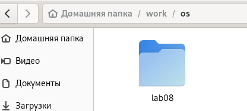{ #fig:002 width=70%}

2. Перешли во вновь созданный каталог. (рис. [-@fig:003])

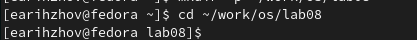{ #fig:003 width=70%}

3. Вызвали vi и создали файл hello.sh (рис. [-@fig:004])

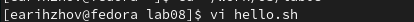{ #fig:004 width=70%}

4. Нажали клавишу i и ввели следующий текст. (рис. [-@fig:005])

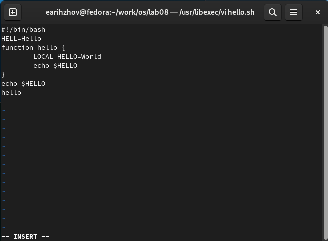{ #fig:005 width=70%}

5. Нажали клавишу Esc для перехода в командный режим после завершения ввода
текста. (рис. [-@fig:006])

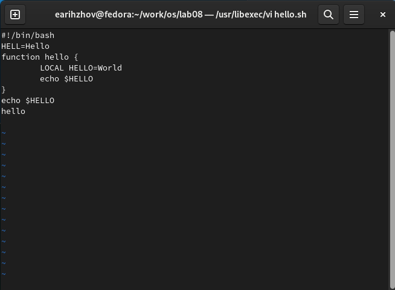{ #fig:006 width=70%}

6. Нажмите : для перехода в режим последней строки и внизу вашего экрана появится
приглашение в виде двоеточия. (рис. [-@fig:007])

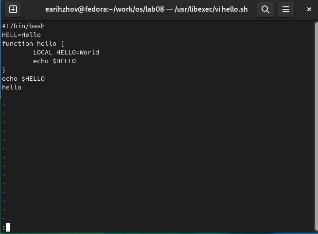{ #fig:007 width=70%}

7. Нажмите w (записать) и q (выйти), а затем нажмите клавишу Enter для сохранения
вашего текста и завершения работы. (рис. [-@fig:008])

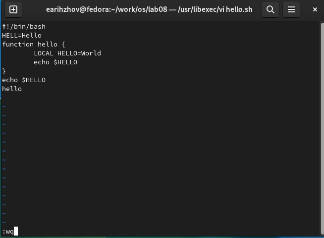{ #fig:008 width=70%}

8. Сделали файл исполняемым. (рис. [-@fig:009])

{ #fig:009 width=70%}

## Задание 2. Редактирование существующего файла

1. Вызвали vi на редактирование файла. (рис. [-@fig:010])

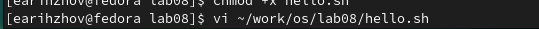{ #fig:010 width=70%}

2. Установили курсор в конец слова HELL второй строки. (рис. [-@fig:011])

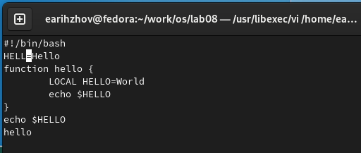{ #fig:011 width=70%}

3. Перешли в режим вставки и замените на HELLO. Нажали Esc для возврата в командный режим. (рис. [-@fig:012])

{ #fig:012 width=70%}

4. Установили курсор на четвертую строку и стёрли слово LOCAL. (рис. [-@fig:013])

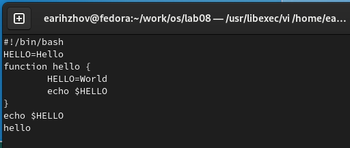{ #fig:013 width=70%}

5. Перешли в режим вставки и наберите следующий текст: local, нажмите Esc для
возврата в командный режим. (рис. [-@fig:014])

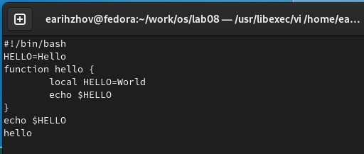{ #fig:014 width=70%}

6. Установили курсор на последней строке файла. Вставили после неё строку, содержащую
следующий текст: echo $HELLO. (рис. [-@fig:015])

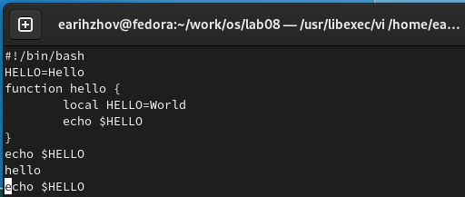{ #fig:015 width=70%}

7. Нажали Esc для перехода в командный режим.
8. Удалили последнюю строку. (рис. [-@fig:016])

{ #fig:016 width=70%}

9. Ввели команду отмены изменений u для отмены последней команды. (рис. [-@fig:017])

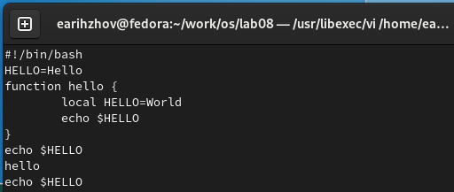{ #fig:017 width=70%}

10. Ввели символ : для перехода в режим последней строки. Записали произведённые
изменения и выйдите из vi. (рис. [-@fig:018])

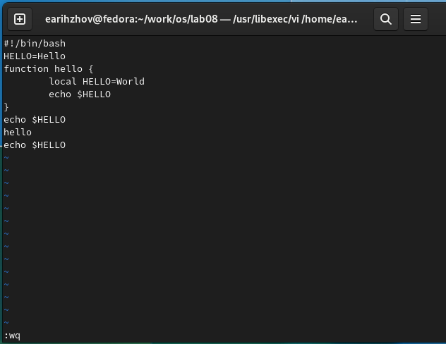{ #fig:018 width=70%}

# Выводы

В ходе выполнения лабораторной работы ознакомились с операционной системой Linux. Получили практические навыки работы с редактором vi, установленным по умолчанию практически во всех дистрибутивах.

# Ответы на контрольные вопросы

1. Дайте краткую характеристику режимам работы редактора vi.

	Редактор vi имеет три режима работы:
	– командный режим — предназначен для ввода команд редактирования и навигации по
	редактируемому файлу;
	– режим вставки — предназначен для ввода содержания редактируемого файла;
	– режим последней (или командной) строки — используется для записи изменений в файл
	и выхода из редактора.

2. Как выйти из редактора, не сохраняя произведённые изменения?(q)

3. Назовите и дайте краткую характеристику командам позиционирования.

– 0 (ноль) — переход в начало строки;
– $ — переход в конец строки;
– G — переход в конец файла;
– n G — переход на строку с номером n.

4. Что для редактора vi является словом?

Редактор vi предполагает, что слово - это строка символов, которая может включать в себя буквы, цифры и символы подчеркивания.

5. Каким образом из любого места редактируемого файла перейти в начало (конец)
файла?(gg)

6. Назовите и дайте краткую характеристику основным группам команд редактирования.

Вставка текста
– а — вставить текст после курсора;
– А — вставить текст в конец строки;
– i — вставить текст перед курсором;
– n i — вставить текст n раз;
– I — вставить текст в начало строки.

Вставка строки
– о — вставить строку под курсором;
– О — вставить строку над курсором.

Удаление текста
– x — удалить один символ в буфер;
– d w — удалить одно слово в буфер;
– d $ — удалить в буфер текст от курсора до конца строки;
– d 0 — удалить в буфер текст от начала строки до позиции курсора;
– d d — удалить в буфер одну строку;
– n d d — удалить в буфер n строк.

Отмена и повтор произведённых изменений
– u — отменить последнее изменение;
– . — повторить последнее изменение.

Копирование текста в буфер
– Y — скопировать строку в буфер;
– n Y — скопировать n строк в буфер;
– y w — скопировать слово в буфер.

Вставка текста из буфера
– p — вставить текст из буфера после курсора;
– P — вставить текст из буфера перед курсором.

Замена текста
– c w — заменить слово;
– n c w — заменить n слов;
– c $ — заменить текст от курсора до конца строки;
– r — заменить слово;
– R — заменить текст.

Поиск текста
– / текст — произвести поиск вперёд по тексту указанной строки символов текст;
– ? текст — произвести поиск назад по тексту указанной строки символов текст.

7. Необходимо заполнить строку символами $. Каковы ваши действия?

Скопировать символ $ в буфер использовать следующую комвнду редактирования 50i

8. Как отменить некорректное действие, связанное с процессом редактирования?(u)

9. Назовите и дайте характеристику основным группам команд режима последней строки.

Копирование и перемещение текста
– : n,m d — удалить строки с n по m;
– : i,j m k — переместить строки с i по j, начиная со строки k;
– : i,j t k — копировать строки с i по j в строку k;
– : i,j w имя-файла — записать строки с i по j в файл с именем имя-файла.

Запись в файл и выход из редактора
– : w — записать изменённый текст в файл, не выходя из vi;
– : w имя-файла — записать изменённый текст в новый файл с именем имя-файла;
– : w ! имя-файла — записать изменённый текст в файл с именем имя-файла;
– : w q — записать изменения в файл и выйти из vi;
– : q — выйти из редактора vi;
– : q ! — выйти из редактора без записи;

10. Как определить, не перемещая курсора, позицию, в которой заканчивается строка?

– / текст — произвести поиск вперёд по тексту указанной строки символов текст;
– ? текст — произвести поиск назад по тексту указанной строки символов текст

11. Выполните анализ опций редактора vi.

Опции редактора vi позволяют настроить рабочую среду. Для задания опций используется команда set (в режиме последней строки):
– : set all — вывести полный список опций;
– : set nu — вывести номера строк;
– : set list — вывести невидимые символы;
– : set ic — не учитывать при поиске, является ли символ прописным или строчным.

12. Как определить режим работы редактора vi?

В режиме последней строки внизу страницы находится ":".
В режиме вставки внизу страницы написано "-- INSERT --".
В режиме коммандной строки эти обозначения отсутствуют.

13. Постройте граф взаимосвязи режимов работы редактора vi. (рис. [-@fig:019])

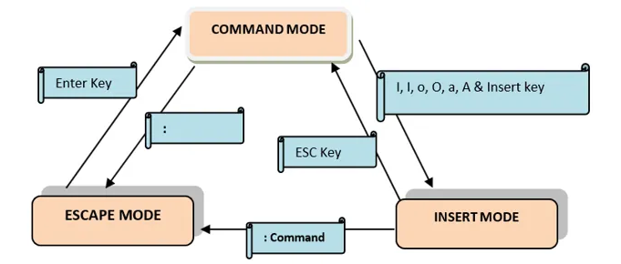{ #fig:019 width=70%}
